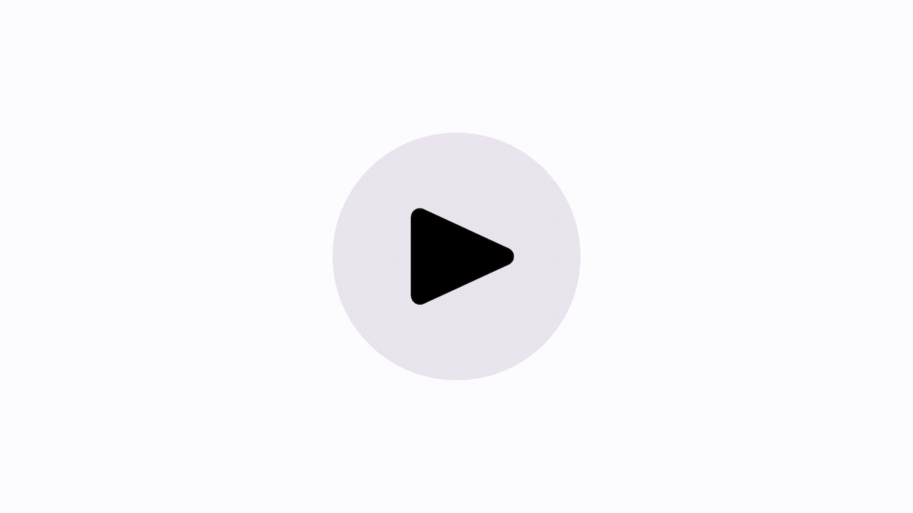

# PlayButton

[](https://github.com/public-value-tech/play-button/actions/workflows/tests.yml)
[](https://swiftpackageindex.com/public-value-tech/play-button)
[](https://swiftpackageindex.com/public-value-tech/play-button)

A button that can render four different playback related modes and animate between them.


### Installation (Swift Package Manager)

The [Swift Package Manager](https://swift.org/package-manager/) is a tool for automating the distribution of Swift code and is integrated into the `swift` compiler. 

Once you have your Swift package set up, adding PlayButton as a dependency is as easy as adding it to the `dependencies` value of your `Package.swift`.

```swift
dependencies: [
  .package(url: "https://github.com/public-value-tech/play-button.git", .branch("main"))
]
```

### Usage

```swift
import PlayButton

let playButton = PlayButton() // defaults to CGSize(width: 44, height: 44)
playButton.playBufferingBackgroundColor = .systemBlue
playButton.pauseStopBackgroundColor = .systemBlue
playButton.playBufferingTintColor = .white
playButon.pauseStopTintColor = .white

// Animate the mode update
playButton.setMode(.stop, animated: true)

// iOS / macCatalyst 
playButton.addTarget(self, action: #selector(playButtonTapped), for: .touchUpInside))

// tvOS
playButton.addTarget(self, action: #selector(playButtonTapped), for: .primaryActionTriggered)
```

<p align="center">
  
</p>
<p align="center">
  
</p> 

### Documentation

Check out the [documentation](https://swiftpackageindex.com/public-value-tech/play-button/documentation/playbutton) or just compile it yourself when you add the package to your projects. 

### Tests

The tests mostly consist of snapshot tests. We use a `CADisplayLink` to sample some frames from the animation and diff them against reference snapshots. Since there is some expected deviation we add some tolerance to the tests.

### How it all started

You may wonder what's so special about this play button. In [this article](https://medium.com/br-next/open-sourcing-our-br-radio-playbutton-5f0b14bb7e01) we describe the difficulties we have faced implementing an interruptible and reversible animation in Core Animation.
